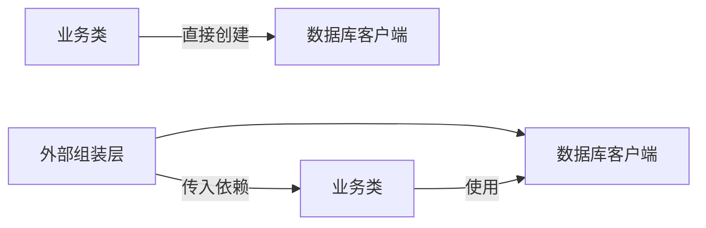

# 单个知识点范文

## 示例：依赖注入（约 1200 字结构）

### 2.3.1.4 依赖注入：把“自己找工具”改成“别人递工具”

#### 场景钩子

想象你要修一台电脑。第一种做法是你自己跑去仓库找螺丝刀、万用表和备用硬盘；第二种做法是助手提前把工具箱递给你。你只负责修电脑，不负责到处找工具。代码里的依赖注入，解决的就是类似问题：一个对象到底应该自己创建依赖，还是由外部把依赖传进来。

#### 类比解释

如果一个类在内部直接创建数据库连接、网络客户端或配置读取器，它就像一个什么都自己包办的人。看起来独立，实际上很难测试，也很难替换工具。依赖注入（Dependency Injection, DI）则把这些依赖从外部传入。这样同一段业务逻辑可以在生产环境使用真实数据库，在测试环境使用内存对象，在教学示例中使用最小假数据。

#### 正式定义

依赖注入是一种对象协作方式：组件不在内部创建它所依赖的对象，而是通过构造函数、函数参数、属性或容器由外部提供依赖。它的目标不是“让代码变高级”，而是降低耦合、提升可测试性和可替换性。

#### 来源定位

本知识点可以来自三类来源共同支撑：

- 英文网站或书籍中的 `Dependency Injection` 定义。
- 当前代码库中服务类、控制器、模块初始化部分的构造函数。
- 测试文件中如何替换真实依赖。

如果项目中有类似 `new DatabaseClient()` 直接写在业务类内部的代码，可以作为反例；如果构造函数接收 `DatabaseClient`，则可作为正例。

#### 图示



#### 代码片段

```python
class UserService:
    def __init__(self, repository):
        self.repository = repository

    def find_user(self, user_id):
        return self.repository.get(user_id)
```

这段代码的重点不是 Python 语法，而是责任边界：`UserService` 只关心“怎么查用户”，不关心 `repository` 到底来自数据库、文件还是测试假对象。对于学习者来说，这一步很关键，因为它把“业务逻辑”和“资源创建”拆开了。

#### 小实验

写两个 `repository`：

1. 一个从字典读取用户。
2. 一个模拟从数据库读取用户。

然后让同一个 `UserService` 分别使用它们。如果 `UserService` 不需要改，就说明依赖边界设计得比较清楚。

#### 常见坑

1. **为了 DI 而 DI**：一个很小的脚本没有复杂依赖时，不必引入容器。
2. **只换了写法，没降耦合**：虽然参数传进来了，但业务类仍然知道太多底层细节。
3. **测试只测假对象**：测试替换依赖是手段，目标仍然是验证真实业务行为。

#### 检查问题

1. 这个类内部创建了哪些外部资源？
2. 这些资源能不能从外部传入？
3. 替换依赖后，业务逻辑是否不用修改？
4. 这个设计让测试更简单，还是更复杂？

#### 小结过渡

依赖注入的核心，是把“使用什么”和“怎么创建”分开。下一节可以继续讲接口、抽象类或模块装配，因为它们都是围绕同一个问题展开：怎样让代码既能协作，又不互相绑死。

## 套用要求

写任何知识点时，都不要只给定义。至少补齐：

- 一个真实场景。
- 一个类比。
- 一个正式解释。
- 一个来源定位。
- 一个图或表。
- 一个例子、实验或代码片段。
- 三个常见坑。
- 两到五个检查问题。
- 一个能引向下一节的过渡。
